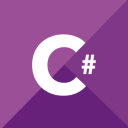
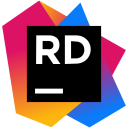
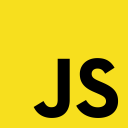
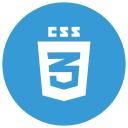
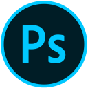

## Heyo bananas! 😎🍌🍌

- [#i_support_creative_society](https://creativesociety.com/8-foundations-of-a-creative-society)
- 👨‍💻 I'm 20 y/o .NET Fullstack developer 🌆 From the famous Kyiv city.
- I'm writing my library 📜 [NeerCore](https://github.com/jurilents/NeerCore) for .NET. I believe that it has prospects 📈 :)
- You can also subscribe to my [telegram channel](https://t.me/nocitats) 👉👈.

 

### Familiar technologies for me

    
    
    
    
    
    
    
    
    
    
    
    
    
    

    
    
    
    
    
    
    
    
    
    
    
    
    
    

TODO: Add Angular to tech list and also remove React 💻☕️🚀.

 
 

    

